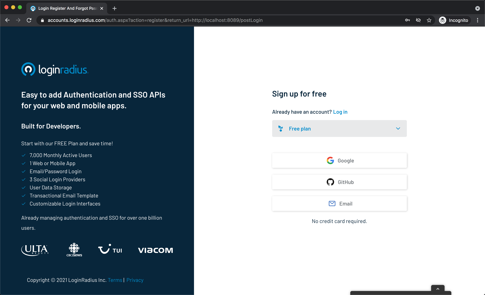
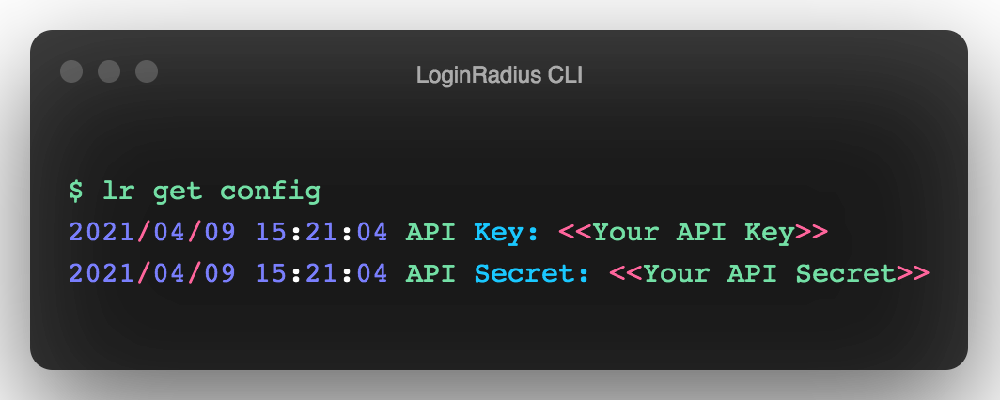
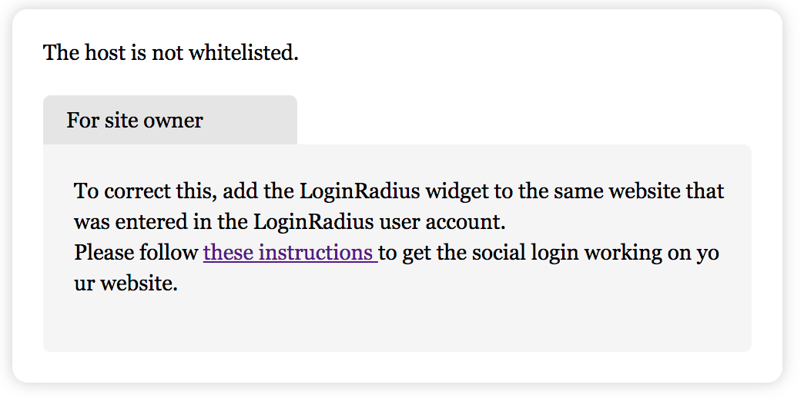
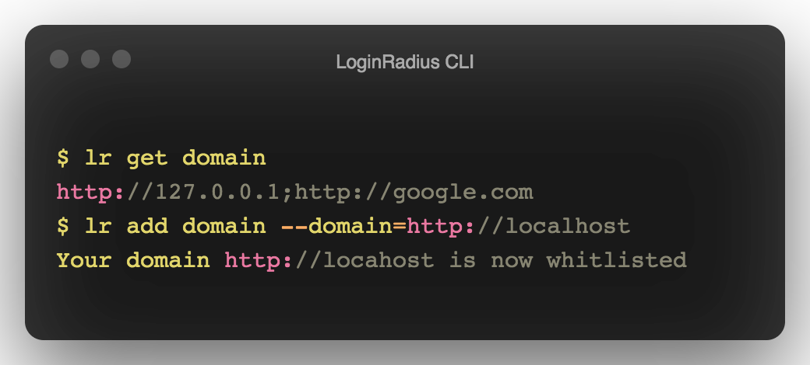
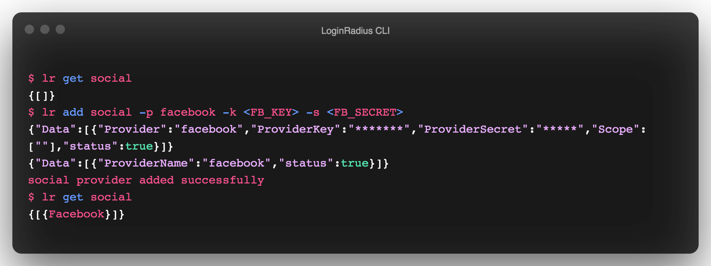

Hello Guys!!!, today we will be implemented the authentication in the Angular 2+ application within 5 mins using [LoginRadius](https://accounts.loginradius.com/auth.aspx?return_url=https://dashboard.loginradius.com/login).

## Configuring LoginRadius

To implement authentication in the angular app first let's start with registering in the Loginradius and creating the application using [LoginRadius CLI](https://github.com/LoginRadius/lr-cli).

### LoginRadius CLI Setup

#### Mac or Linux

- Install the tap via:

    ```sh
    $ brew tap loginradius/tap
    ```
- Then, you can install LR CLI via:

    ```sh
    $ brew install lr
    ```
    
#### Other Platforms

- Download packaged binaries from the [release page](https://github.com/loginradius/lr-cli/releases/latest).

After installing the CLI, you can register into the LoginRadius via the below command.

```sh
$ lr register
```

This command will open the Loginradius in the browser to register yourself and create the app.



Once you successfully register you will be able to see the below message on the browser, you can close the tab and come back to the CLI.

```
You are Successfully Authenticated, Kindly Close this browser window and go back to CLI.
```

### Get Your Application API Credentials

Once you **login/register** using the CLI, You can now run the `lr get config` command to get your API credentials. 



### Configuring Callback URLs

A callback URL is a URL in your application where LoginRadius redirects the user after they have authenticated. The callback URL for your app must be added to your Application Configuration. If this field is not set, users will be unable to log in to the application and get an error.



To get the list of whitelisted domains, you can run `lr get domain` command from the cmd prompt. And to add a domain in the list using `lr add domain` command. 

> If you are following this tutorial, you should set the  http://localhost as a whitelisted domain. Check the below image for how to add the domain using LoginRadius CLI.



### Setup Angular application

You can implement the LoginRadius authentication in your existing Angular application, or you can start from scratch by following [this tutorial](https://angular.io/guide/setup-local).

> You need to enable the routing for this tutorial if you are not aware of how to enable routing in the angular application, kindly follow [this tutorial](https://angular.io/guide/router)

- Create `src/app/config.ts` and add the below application configuration
    ```ts
    const config = {
      APP_NAME: '<<Your App Name>>',
      API_KEY: '<<Your API Key>>',
    };
    export default config;
    ```

### Add Login to Your Application

If you have already created the login component, add the following code in the `.ts` file else, generate the login component using ng CLI `ng generate component login`. Which will create a component inside the `app` folder. Add the following code to the `login.component.ts`

```ts
import { Component, OnInit } from '@angular/core';

import { ActivatedRoute, Router } from '@angular/router';

import config from '../config';

@Component({
  selector: 'app-login',
  templateUrl: './login.component.html',
  styleUrls: ['./login.component.scss'],
})
export class LoginComponent implements OnInit {
  constructor(private route: ActivatedRoute, private router: Router) {
    this.route.queryParams.subscribe((params) => {
      if (params.token || localStorage.getItem('token')) {
        localStorage.setItem('token', params.token);
        this.router.navigate(['/profile']);
      } else {
        window.location.href = `https://${config.APP_NAME}.hub.loginradius.com/auth.aspx?return_url=${window.location.origin}/login`;
      }
    });
  }

  ngOnInit(): void {}
}
```

Here we are redirecting the application to the **LoginRadius Auth Page** where we are passing the `return_url` as the current origin, so after successful login, the **LoginRadius Auth Page** will redirect to the angular application with `token` as a query param. Later we will use `token` for all the user-related actions.

### Add Profile Page

As you have seen in the above code on successful login, we redirect to `/profile` page. So let us create a **profile** component using `ng` CLI `ng generate component profile`.
And let's modify the `profile.component.ts` file in the `app/profile` folder generated by ng CLI.

```ts
import { Component, OnInit } from '@angular/core';
import { Router } from '@angular/router';
import config from '../config';
import { ProfileService } from '../profile.service';
import { Profile } from './profile';

@Component({
  selector: 'app-profile',
  templateUrl: './profile.component.html',
  styleUrls: ['./profile.component.scss'],
})
export class ProfileComponent implements OnInit {
  profile: Profile;
  loginRadius: any;

  constructor(private configService: ProfileService, private router: Router) {
    const token = localStorage.getItem('token');
  }

  ngOnInit(): void {
    this.configService.getProfile().subscribe(
      (data: Profile) => {
        this.profile = { ...data };
      },
      (err: any) => {
        if (err.status === 403) {
          localStorage.removeItem('token');
          this.router.navigate(['login']);
        }
      }
    );
  }

  logout() {
    localStorage.removeItem('token');
    window.location.href = `https://${config.APP_NAME}.hub.loginradius.com/auth.aspx?action=logout`;
  }
}
```

Similary add the below code to `profile.component.html` file.
```html
<div class="container">
  <h1>Hello {{ profile?.Email[0]?.Value }}</h1>
  <button (click)="logout()">LogOut</button>
</div>
```

The profile component will call the LoginRadius API to fetch the profile details and store them in the `profile` variable. Using that `profile`, we are displaying the email in the HTML. 
It also has the `logout()` function where we pass the `action=logout` in the **LoginRadius Auth Page**, which will help us log out the user.

In the profile component, you can see the two things are used.
- ProfileService - This is the service to fetch the user profile using the token.
- Profile - The model which will be used to store the profile information.

You can generate the service in the angular using `ng` CLI by using this command `ng generate service profile` which will create `profile.service.ts` with required configuration. Add the below code in the `profile.service.ts` file.
```ts
import { HttpClient } from '@angular/common/http';
import { Injectable } from '@angular/core';
import config from './config';
import { Profile } from './profile/profile';

@Injectable({
  providedIn: 'root'
})
export class ProfileService {

  constructor(private http: HttpClient) {}

  getProfile() {
    // now returns an Observable of Config
    return this.http.get<Profile>(
      `https://api.loginradius.com/identity/v2/auth/account?access_token=${localStorage.getItem(
        'token'
      )}&apikey=${config.API_KEY}`
    );
  }
}
```

We will use the HTTP module to call the Rest API so let's add the `HttpClientModule` in the  `app.module.ts` file.

```ts
import { HttpClientModule } from '@angular/common/http';
...

@NgModule({
  imports: [
    ...
    HttpClientModule
    ...
  ],
})
export class AppModule { }
```

Now let's create a `Profile` model which will be used for storing the user profile. 
- Add `src/app/profile/profile.ts`
  ```ts
  export interface Profile {
      Email: {
        Type: string;
        Value: string;
      }[];
    }
  ```

### Add Routes for Login and profile.

Lets modify the `app-routing.module.ts` and add the below Routes in it.
```ts
import { NgModule } from '@angular/core';
import { RouterModule, Routes } from '@angular/router';
import { AppComponent } from './app.component';
import { LoginComponent } from './login/login.component';
import { ProfileComponent } from './profile/profile.component';

const routes: Routes = [
  {
    path: 'login',
    component: LoginComponent
  },
  { path: 'profile',
    component: ProfileComponent
  }
];

@NgModule({
  imports: [RouterModule.forRoot(routes)],
  exports: [RouterModule]
})
export class AppRoutingModule { }
```

Finally, to gather all, we need to modify the `app.component.ts` and add the routing logic.

```ts
import { Component, OnInit } from '@angular/core';
import { Router } from '@angular/router';
@Component({
  selector: 'app-root',
  templateUrl: './app.component.html',
  styleUrls: ['./app.component.scss'],
})
export class AppComponent implements OnInit {
  constructor(private router: Router) {}

  ngOnInit() {
    if (window.location.pathname === "/") {
      if (localStorage.getItem('token')) {
        this.router.navigate(['/profile']);
      } else {
        this.router.navigate(['/login']);
      }
    }
  }
}
```
And add the `router-outlet` to the `app.component.html` file.
```html
<router-outlet></router-outlet>
```

> You can find the full code in [github](https://github.com/LoginRadius/engineering-blog-samples/tree/master/Angular/angular-authentication-demo)

### Testing the application
Run `ng serve` to start the local server, and you will be able to see the output on [locahost:4200](http://locahost:4200).


### Adding Login Methods

We can configure the LoginRadius Auth Page by adding social login methods like Facebook, Google, etc. To add the login method, you can use the command `lr get social` and `lr add social` command. Check the below image on how to add the social configuration.



After adding, visit the LoginRadius Auth Page either by visiting [locahost:4200](http://locahost:4200) and log out. Or using the command `lr demo`. You will find the new login method added.


### Contributing to LoginRadius CLI

The [LoginRadius CLI](https://github.com/LoginRadius/lr-cli/) is opensourced in the [LoginRadius Organization](https://github.com/LoginRadius)  and you can contribute to it if you find any bugs or improvement by following the contributing guidelines. You can also checkout our [open source page](https://www.loginradius.com/open-source/) if you wish to contribute more in LoginRadius.

### Your Take

With the help of LoginRadius CLI, you can setup the authentication for your Angular application in just 5 minutes. LoginRadius will take care of all the authentication-related stuff for your application so that you can focus on your application development.

I hope you like this tutorial. Kindly provide feedback suggestions in the comment section below.

Cheers!!!
